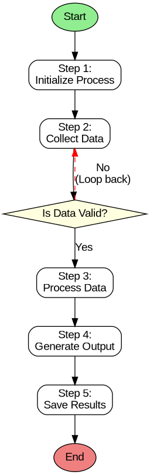

<<<<<<< copilot/build-kubernetes-with-priority-scheduler
# Kubernetes Priority Scheduler for GPU Servers

This repository provides a comprehensive guide for building a Kubernetes cluster with priority-based scheduling for GPU workloads across five servers.

## 📖 Documentation

Visit the [live site](https://um-cse-k8s.github.io/UM-CSE-K8S.github.io/) for the complete guide.

## 🎯 What's Included

- **Complete setup guide** for a 5-node Kubernetes cluster
- **GPU support configuration** with NVIDIA device plugin
- **Priority scheduler setup** with multiple priority classes
- **Example configurations** for high, medium, and low priority workloads
- **Testing and verification** procedures

## 🚀 Quick Start

1. Follow the step-by-step guide in [index.html](index.html)
2. Use the example YAML configurations in the [configs/](configs/) directory
3. Test priority-based scheduling with the provided examples

## 📦 Repository Structure

```
.
├── index.html                          # Main documentation page
├── configs/                            # Kubernetes YAML configurations
│   ├── priority-classes.yaml          # Priority class definitions
│   ├── high-priority-pod.yaml         # High-priority pod example
│   ├── medium-priority-job.yaml       # Medium-priority job example
│   ├── low-priority-deployment.yaml   # Low-priority deployment example
│   └── README.md                       # Configuration usage guide
└── README.md                           # This file
```

## 🏗️ Architecture

- **1 Control Plane Node** (gpu-server-01): Master node managing the cluster
- **4 Worker Nodes** (gpu-server-02 to 05): GPU-enabled nodes running workloads

## 🔑 Key Features

- ✅ Priority-based pod scheduling
- ✅ Pod preemption for high-priority workloads
- ✅ GPU resource management
- ✅ Multi-node cluster setup
- ✅ Production-ready configuration

## 📝 Prerequisites

- 5 servers with Ubuntu 20.04 or 22.04 LTS
- NVIDIA GPUs on worker nodes
- Network connectivity between all nodes
- Basic Kubernetes knowledge

## 🤝 Contributing

Feel free to open issues or submit pull requests to improve this guide.

## 📄 License

This project is open source and available for educational purposes.
=======
# UM-CSE-K8S.github.io
Showing progresses on the k8s priority

## Flowchart Diagram

This repository includes a Graphviz flowchart diagram that demonstrates a process flow with the following components:

- **5 sequential steps**: Initialize Process → Collect Data → Process Data → Generate Output → Save Results
- **Decision block**: "Is Data Valid?" with Yes/No branches
- **Loop mechanism**: If data is invalid, the flow loops back to the data collection step

### Files

- `flowchart.dot` - Graphviz source file
- `flowchart.png` - PNG rendering of the flowchart
- `flowchart.svg` - SVG rendering of the flowchart

### Viewing the Diagram



### Rendering the Diagram

To regenerate the diagram images from the source file:

```bash
dot -Tpng flowchart.dot -o flowchart.png
dot -Tsvg flowchart.dot -o flowchart.svg
```
>>>>>>> main
