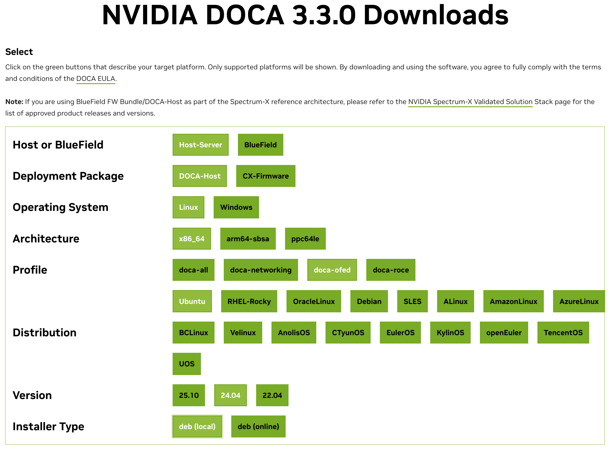

# How to connect two GPU servers using Infiniband DAC cables


## 1. NIC User manual


- [NVIDIA ConnectX-7 Adapter Cards User Manual](https://docs.nvidia.com/networking/display/nvidia-connectx-7-adapter-cards-user-manual.pdf)  in PDF.


### Check MLX card is up
- downloaded [mlxup](https://network.nvidia.com/support/firmware/mlxup-mft/)  and query the NIC card with commands:

```
vyl@csegpu1:~/ofed$ lspci |grep mellanox -i

0000:8e:00.0 Infiniband controller: Mellanox Technologies MT2910 Family [ConnectX-7]

vyl@csegpu1:~$ which mlxup
/usr/sbin/mlxup

vyl@csegpu1:~/ofed$ sudo mlxup -d 0000:8e:00.0

Querying Mellanox devices firmware ...

Device #1:
----------

  Device Type:      ConnectX7
  Part Number:      MCX75310AAS-NEA_Ax
  Description:      NVIDIA ConnectX-7 HHHL Adapter card; 400GbE / NDR IB (default mode); Single-port OSFP; PCIe 5.0 x16; Crypto Disabled; Secure Boot Enabled;
  PSID:             MT_0000000838
  PCI Device Name:  0000:8e:00.0
  Base GUID:        9c63c00300abe882
  Versions:         Current        Available     
     FW             28.46.3048     28.47.1026    
     PXE            3.8.0100       N/A           
     UEFI           14.39.0014     N/A           

  Status:           Update required

---------
Found 1 device(s) requiring firmware update...

Perform FW update? [y/N]: y
Device #1: Updating FW ...     
FSMST_INITIALIZE -   OK          
Writing Boot image component -   OK          
Done

Restart needed for updates to take effect.
Log File: /tmp/mlxup_workdir/mlxup-20260512_145143_60339.log
vyl@csegpu1:~/ofed$ 

```

## install OFRD Driver

- Do not use this: [HowTo Install MLNX_OFED Driver, Jan. 24, 2026](https://enterprise-support.nvidia.com/s/article/howto-install-mlnx-ofed-driver). Use DOCA_OFED below.
  - Do Not Use This: [Installing mellanox ofed drivers for my ubuntu 22.04.5 LTS with kernel version 5.15.0-131-generic](https://forums.developer.nvidia.com/t/installing-mellanox-ofed-drivers-for-my-ubuntu-22-04-5-lts-with-kernel-version-5-15-0-131-generic/322431)


## Install DOCA OFED Driver etc.
- Goto [nVidia DOCA Download page](https://developer.nvidia.com/doca-downloads?deployment_platform=Host-Server) (the old name is [MLNX_OFED](https://network.nvidia.com/products/infiniband-drivers/linux/mlnx_ofed/), which will expired support in Oct. 2027.)

  - We need to select: Host Server - DOCA Host - Linux - X86_64 - doca-ofed - Ubuntu - 24.04 - deb(local).  See below 

  - follow the installation instructions: 
```
wget https://www.mellanox.com/downloads/DOCA/DOCA_v3.3.0/host/doca-host_3.3.0-088000-26.01-ubuntu2404_amd64.deb
sudo dpkg -i doca-host_3.3.0-088000-26.01-ubuntu2404_amd64.deb
sudo apt-get update
sudo apt-get -y install doca-ofed
```
We want to verify the SHA256 checksum by 
```
vyl@csegpu2:~/ofed$ check256sum -c SHA256SUMS --ignore-missing  
doca-host_3.3.0-088000-26.01-ubuntu2404_amd64.deb: OK
mlxup: OK
```

### In one case, above installation failed on csegpu1, so eventually we upgrade nvidia GPU driver to 595.71.05 instead of 595.48.01
- Update the open source NVidia Driver to [NVidia 595.71.05](https://developer.nvidia.com/datacenter-driver-downloads?target_os=Linux&target_arch=x86_64&Distribution=Ubuntu&target_version=24.04&target_type=deb_local).  This avoid the conflicts between linux header and NVidia driver 595.58 when we install DOCA OFED driver. 


## Uninstall DOCA_OFED Driver

If we need to uninstall DOCA_OFED, use the first step in [DOCA  Doc v3.3.0](https://docs.nvidia.com/doca/sdk/doca-host-installation-and-upgrade/index.html)
## enable IP over IB: 

## 
After install OFED driver, use this article on [How to Configure InfiniBand on Ubuntu](https://oneuptime.com/blog/post/2026-03-02-how-to-configure-infiniband-on-ubuntu/view), and skip the MLNX_OFED installation step, but use the rest of the steps. 

### Verify Cable is LinkUp

use the command in [this video at 1:45](https://youtu.be/a1SsyS2i1Bw?si=6kbTG08ZRp5EiCKm&t=105), we can see both NICs have LinkUp state.
```
vyl@csegpu1:~$ sudo mlxlink -d /dev/mst/mt4129_pciconf0 --show_mo

Operational Info
----------------
State                              : Active 
Physical state                     : LinkUp 
Speed                              : IB-NDR 
Width                              : 4x 
FEC                                : Ethernet_Consortium_LL_50G_RS_FEC_PLR -(272,257+1) 
Loopback Mode                      : No Loopback 
Auto Negotiation                   : ON 

Supported Info
--------------
Enabled Link Speed                 : 0x000000f1 (NDR,HDR,EDR,FDR,SDR) 
Supported Cable Speed              : 0x000000f1 (NDR,HDR,EDR,FDR,SDR) 

Troubleshooting Info
--------------------
Status Opcode                      : 0 
Group Opcode                       : N/A 
Recommendation                     : No issue was observed 

Tool Information
----------------
Firmware Version                   : 28.46.3048 
amBER Version                      : 6.4 
MFT Version                        : 4.35.0-159 

Module Info
-----------
Temperature [C]                    : 0 [0..0]
Voltage [mV]                       : 0 [0..0]
Bias Current [mA]                  : 0,0,0,0 [0..0]
Rx Power Current [dBm]             : 0,0,0,0 [0..0]
Tx Power Current [dBm]             : 0,0,0,0 [0..0]
Identifier                         : OSFP
Compliance                         : IB NDR
Cable Technology                   : Copper cable, passive, unequalized
Cable Type                         : Passive copper cable
OUI                                : Nvidia
Vendor Name                        : FS
Vendor Part Number                 : OSFPFL-400G-PC01
Vendor Serial Number               : C2604279049-2
Rev                                : 00
Wavelength [nm]                    : N/A
Transfer Distance [m]              : 1
Attenuation (5g,7g,12g,25g)[dB]    : 0,0,0,0
FW Version                         : N/A
Digital Diagnostic Monitoring      : Yes
Power Class                        : N/A
MAX Power                          : N/A
CDR RX                             : N/A
CDR TX                             : N/A
LOS Alarm                          : N/A
SNR Media Lanes [dB]               : N/A
SNR Host Lanes [dB]                : N/A
IB Cable Width                     : 1x,2x,4x,8x
Memory Map Revision                : 64
Linear Direct Drive                : 0
Cable Breakout                     : OSFP to OSFP
SMF Length                         : N/A
Cable Rx AMP                       : N/A
Cable Rx Emphasis (Pre)            : N/A
Cable Rx Post Emphasis             : N/A
Cable Tx Equalization              : N/A
Wavelength Tolerance               : N/A
Module State                       : Ready state
DataPath state [per lane]          : N/A,N/A,N/A,N/A
Rx Output Valid [per lane]         : 0,0,0,0
Nominal bit rate                   : N/A
Rx Power Type                      : OMA
Manufacturing Date                 : 09_04_26
Active Set Host Compliance Code    : IB NDR
Active Set Media Compliance Code   : N/A
Error Code Response                : ConfigUndefined
Module FW Fault                    : 0
DataPath FW Fault                  : 0
Tx Fault [per lane]                : 0,0,0,0
Tx LOS [per lane]                  : 0,0,0,0
Tx CDR LOL [per lane]              : 0,0,0,0
Rx LOS [per lane]                  : 1,0,1,1
Rx CDR LOL [per lane]              : 1,1,1,1
Tx Adaptive EQ Fault [per lane]    : 0,0,0,0

vyl@csegpu1:~$ 
```