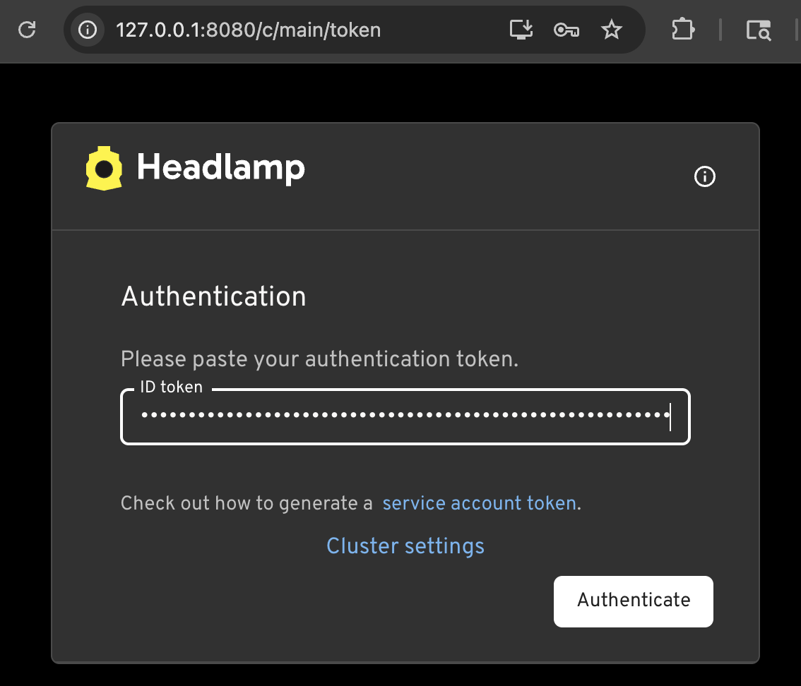
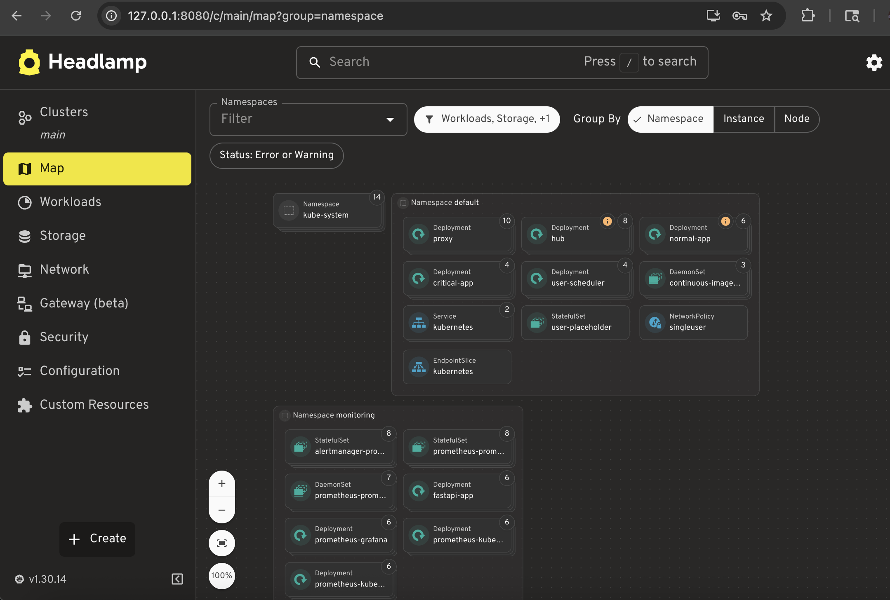

# Kubernetes Mockup System

We have installed following VMs to test Kubernetes on ```gaia.eecs.umich.edu```:

| hostname | Role   | IP Address    | Hardware | Software |
|----------|--------|---------------|----------|---------|
| k0       | master | 192.168.8.146 | 2 core 8G Mem 50GB HDD | Ubuntu 24.04.3 LTS |
| k1       | worker | 192.168.8.147 | 2 core 8G Mem 20GB HDD | Ubuntu 24.04.3 LTS |
| k2       | worker | 192.168.8.148 |  2 core 8G Mem 20GB HDD | Ubuntu 24.04.3 LTS |
| k2       | worker | 192.168.8.149 |  2 core 8G Mem 20GB HDD | Ubuntu 24.04.3 LTS |

## How to Access

Users should prepare following steps to access the cluster:

- Be able to access ```gaia.eecs.umich.edu```
  - Request access via [CSE DCO](https://www.eecs.umich.edu/dco/about.php), or from server admin staff.
  - On UM Campus or have [UM Net VPN](https://its.umich.edu/enterprise/wifi-networks/vpn/getting-started) while off campus. 
  - SSH via their UM uniqname and Password initially as ```ssh uniqname@gaia.eecs.umich.edu```
  - Optional: setup public key authentication with these [steps](https://www.redhat.com/en/blog/configure-ssh-keygen) OR [here](https://www.hpc.temple.edu/mhpc/hpc-technology/exercise4/ssh.html).
  - Optional: It is important to setup [SSH Jump Host](https://wiki.gentoo.org/wiki/SSH_jump_host) inside ```~/.ssh/config``` to easier access of VMs inside a physical server.  For example, we have the following setup to access ```k0``` using ```ssh k0``` via the jumphost ```gaia```. (Remember this requires one to setup the public key authentication from ```gaia``` to ```k0``` too!)
```
Host gaia
  HostName gaia.eecs.umich.edu
  User vyl
  IdentityFile ~/.ssh/id_rsa
Host k0
  HostName k0
  ProxyJump  gaia
```

## Create SSH Tunnels to Access Headlamp and Grafana

We have installed [Headlamp](https://headlamp.dev/) and [kube-prometheus-stack](https://artifacthub.io/packages/helm/prometheus-community/kube-prometheus-stack) on Kubernetes to visualize and monitor the k8s cluster respectively.  To access these two services on ```k0```, we need to create two tunnels to access their corresponding web fronts. 

### Access Headlamp via http://localhost:8080

- On your local laptop, assuming a MacBook, creating a tunnel from ```localhost:8080``` to ```localhost:8080``` as below:

vyl@UM-VYL-MBA-20 ~ %
``` bash
ssh -L localhost:8080:127.0.0.1:8080 k0
```
- Once the above command bring you onto ```k0```, obtain the token to be used to authenticate. Copy that token into your clipboard.

``` bash
kubectl create token headlamp-admin -n kube-system
```

- Then continue execute following command to forward the port of headlamp's 80 to localhost:8080. 
``` bash
kubectl port-forward svc/headlamp -n kube-system 8080:80
```

- Open a web browser on your laptop, and visit ```http://127.0.0.1:8080/```.  This should forward you to 
```http://127.0.0.1:8080/c/main/token```
and ask for a token.  
    - Paste what is stored in your clipboard in above step here and click "Authenticate". 
    - 
- Once completed above steps, you should be able to see Headlamp UI to visualize various namespaces, pods, nodes, etc. instead this k8s cluster. 
    - 

### Access Grafana via http://localhost:3000

Similar to the Headlamp steps, Grafana is available on port 3000, as steps below:

- On your local laptop, assuming a MacBook, creating a tunnel from ```localhost:3000``` to ```localhost:3000``` as below:

vyl@UM-VYL-MBA-20 ~ %
``` bash
ssh -L localhost:3000:127.0.0.1:3000 k0
```
- Once the above command bring you onto ```k0```, obtain the token to be used to authenticate. Copy that token into your clipboard.

``` bash
kubectl create token headlamp-admin -n kube-system
```

- Then continue execute following command to forward the port of Grafana's 80 to localhost:3000. 
``` bash
kubectl port-forward svc/prometheus-grafana -n monitoring 3000:80 &
```

- Open a web browser on your laptop, and visit ```http://127.0.0.1:3000/```.  This should forward you to 
```http://127.0.0.1:3000/login```
and ask for username and password.  The default should be ```admin``` and ```prom-operator```.  Alternatively one can run this command to find out on the master node ```k0```:
```
kubectl get secret --namespace monitoring prometheus-grafana -o jsonpath="{.data.admin-password}" | base64 --decode ; echo
```

    - Paste what is stored in your clipboard in above step here and click "Authenticate". 
    - 
- Once completed above steps, you should be able to see Headlamp UI to visualize various namespaces, pods, nodes, etc. instead this k8s cluster. 
    - For example, the [Grafana CPU Usage](http://localhost:3000/d/200ac8fdbfbb74b39aff88118e4d1c2c/kubernetes-compute-resources-node-pods?orgId=1&refresh=10s) should show CPU utilization for various PODS below [CPU Usage](./grafana-cpu.png)


## Steps to setup Kubernetes cluster

- On a remote laptop that can access ```gaia.eecs.umich.edu```, we run this [ansible playbook](https://github.com/UM-CSE-K8S/k8s-ansible/blob/main/k8s-ubuntu24-kubeadm-cilium.yml) below to setup various OS parameters and installing related packages and services on all VMs. 

```ansible-playbook -i inventory.ini k8s-ubuntu24-kubeadm-cilium.yml```


This playbook performs the automated steps from the manual steps listed on this Medium article [How Install Kubernetes on Ubuntu 24.04 (Step-by-Step Guide)](https://www.linuxtechi.com/install-kubernetes-on-ubuntu-24-04/).  We did changed a few parameters:

- Kubernetes version has been moved to 1.35 using variable ```kube_minor```.
- Calico CNI was replaced with Cilium CNI v1.19.0
- Currently we are using containerd.service but it can be modified to use docker.io as discussed in this Medium article on [](https://medium.com/@osama.abusitta/step-by-step-building-a-kubernetes-cluster-from-scratch-on-ubuntu-24-04-2025-guide-822452f14dab)
- To remove this kubernetes installation, see [this page]() or this series of commands:
```kubectl cordon <node-name>```
```kubectl drain <node-name> --delete-emptydir-data --force --ignore-daemonsets ``` 
```kubectl delete node <node-name>```
- When CNI does not work, debug it with [these hints](https://www.google.com/search?q=after+install+kubernetes+on+master+node%2C+the+node+is+NotReady&oq=after+install+kubernetes+on+master+node%2C+the+node+is+NotReady&gs_lcrp=EgZjaHJvbWUyBggAEEUYOTIHCAEQIRiPAtIBCTExMjAyajBqN6gCALACAA&sourceid=chrome&ie=UTF-8)
- For missing CNI, if Calico, use a command in the comment by Michael as ```kubectl apply -f https://docs.projectcalico.org/manifests/calico.yaml```
- For missing CNI, use cilium with [how to install cilium CNI for kubernetes](https://www.google.com/search?q=how+to+install+cilium+CNI+for+kubernetes&oq=how+to+install+cilium+CNI+for+kubernetes&gs_lcrp=EgZjaHJvbWUyBggAEEUYOTIHCAEQIRigATIHCAIQIRigATIHCAMQIRigATIHCAQQIRigATIHCAUQIRigAdIBBzE0OWowajeoAgCwAgA&sourceid=chrome&ie=UTF-8)
- Here is [a comparison of Calico and Cilium](https://www.google.com/search?q=compare+K8S+CNI+between+calico+and+cilium&sca_esv=9447ce1ae06b4598&sxsrf=ANbL-n7pXpn4nkNgU9kstLGxQGJmukD1Lw%3A1770506579834&ei=U8mHaYe7Mqu5p84P6NnG-Q8&biw=1204&bih=713&ved=0ahUKEwjHsI3-wsiSAxWr3MkDHeisMf8Q4dUDCBM&uact=5&oq=compare+K8S+CNI+between+calico+and+cilium&gs_lp=Egxnd3Mtd2l6LXNlcnAiKWNvbXBhcmUgSzhTIENOSSBiZXR3ZWVuIGNhbGljbyBhbmQgY2lsaXVtMgUQABjvBTIFEAAY7wUyCBAAGKIEGIkFMgUQABjvBTIIEAAYgAQYogRItEVQxx1Yz0BwAngBkAEAmAFtoAHrCqoBBDE0LjK4AQPIAQD4AQGYAhKgAsYLwgIKEAAYsAMY1gQYR8ICBBAhGAqYAwCIBgGQBgiSBwQxNC40oAfvO7IHBDEyLjS4B78LwgcGMS4xMS42yAcwgAgA&sclient=gws-wiz-serp)
- [Install Helm](https://helm.sh/docs/intro/install/)
- For k8s visualization tools,  installing [kube-dash](https://www.digitalocean.com/community/conceptual-articles/kubernetes-visualization-tools#kubernetes-dashboard-kube-dashboard), we installed [headlamp](https://headlamp.dev/docs/latest/installation/) instead.  Very nice tool to visualize k8s.
- There is a Medium article on [Raspberry Pi Kubernetes: A Hassle-Guide with Ansible Magic](https://ebenamor.medium.com/raspberry-pi-kubernetes-a-hassle-guide-with-ansible-magic-5e70ec4d5ec9). ToDo
- Installed [Headlamp](https://headlamp.dev/)


## Step 5: GPU server
Currently we see issues on installing Cilium Envoy on csegpu1.  It is always showing "CrashLoopBackOff" state. Debugging it with several recent resolutions seem not working yet. 

## Step 6: Priority 
Partially worked on CPU based VMs.

- Here is an [example](https://medium.com/@muppedaanvesh/a-hands-on-guide-to-kubernetes-priority-classes-%EF%B8%8F-e4d37d789311) of priority class without GPU. ([PDF](./Kubernetes_Priority_Classes.pdf))
- [How to delete the applied pods](https://www.google.com/search?q=how+to+remove+running+pod+using+yaml&oq=how+to+remove+running+pod+using+yaml&gs_lcrp=EgZjaHJvbWUyBggAEEUYOTIHCAEQIRigATIHCAIQIRigATIHCAMQIRigATIHCAQQIRigATIHCAUQIRigATIHCAYQIRifBTIHCAcQIRifBTIHCAgQIRifBTIHCAkQIRiPAtIBCDg2ODlqMGo3qAIAsAIA&sourceid=chrome&ie=UTF-8)

## Nest Steps: 

- YouTube video tutorial on [Prometheus, Grafana & Kubernetes: Installation + Monitoring](https://www.youtube.com/watch?v=r45DkTMMouc) by Rayan Slim.
    - Tested on k8s master node (VM), k0
    - Uses helm charts in [Prometheus Community Kubernetes Helm Charts](https://github.com/prometheus-community/helm-charts)
    - Used SSH tunnels to access localhost:port in the video. See [SSH tunnel error code](https://www.google.com/search?q=expose+port+but+see+channel+4%3A+open+failed%3A+connect+failed%3A+Connection+refused&oq=expose+port+but+see+channel+4%3A+open+failed%3A+connect+failed%3A+Connection+refused&gs_lcrp=EgZjaHJvbWUyBggAEEUYOTIHCAEQIRiPAtIBCTIwNzU4ajBqN6gCALACAA&sourceid=chrome&ie=UTF-8), and [how to create SSH tunnels](https://www.google.com/search?q=how+to+create+ssh+tunnel+with+a+port+open&oq=how+to+create+ssh+tunnel+with+a+port+open&gs_lcrp=EgZjaHJvbWUyBggAEEUYOTIHCAEQIRigATIHCAIQIRigATIHCAMQIRigATIHCAQQIRigATIHCAUQIRirAjIHCAYQIRifBTIHCAcQIRiPAtIBCTEzNDU1ajBqN6gCALACAA&sourceid=chrome&ie=UTF-8)
    - Check if a port was exposed or not 

    - Uses YAML code in [application-monitoring-prometheus](https://github.com/rslim087a/application-monitoring-prometheus)
    - many other good materials on [Rayan Slim's page](https://rslim087a.github.io/rayanslim/)

## ToDo: Slurm Docker Cluster
- Here is the repo for the [Slurm Docker Cluster](https://github.com/stackhpc/slurm-k8s-cluster/blob/main/README.md)


## Trouble Shooting

### missing PKI content:

On [this post](https://github.com/kubernetes/kubernetes/issues/82178), a few lines can be used to recreate PKI certs:
```
kubeadm reset -f
kubeadm init phase certs all --control-plane-endpoint=drk8s.example.com:6443 --apiserver-cert-extra-sans=localhost --v=9
kubeadm init phase kubeconfig all --control-plane-endpoint=drk8s.example.com:644
kubeadm init --control-plane-endpoint drk8s.example.com:6443 --pod-network-cidr=10.244.0.0/16 --upload-certs --v=9 | tee kubeadm-output.txt
```

### Check kubelet failure reason
```
sudo journalctl -xeu kubelet
```

### Error on API Group list

- Error on ["couldn't get current server API group list: Get "http://localhost:8080/api?timeout=32s"]()

### Too Many Open Files

- Stackoverflow post on [listing open files](https://stackoverflow.com/questions/37067434/kubernetes-cant-start-due-to-too-many-open-files-in-system#:~:text=If%20you%20need%20to%20change,sudo%20systemctl%20restart%20docker.service)
- Article on how to fix [Too Many Open Files] (https://ploi.io/documentation/server/how-do-i-fix-the-too-many-open-files-error).
- 

### Migrate worker nodes into Cilium

- Tried the Step 6 on [this article](https://docs.cilium.io/en/stable/installation/k8s-install-migration/), to install cilium first, then add worker nodes.  But later rolled it out using kubectl delete...

